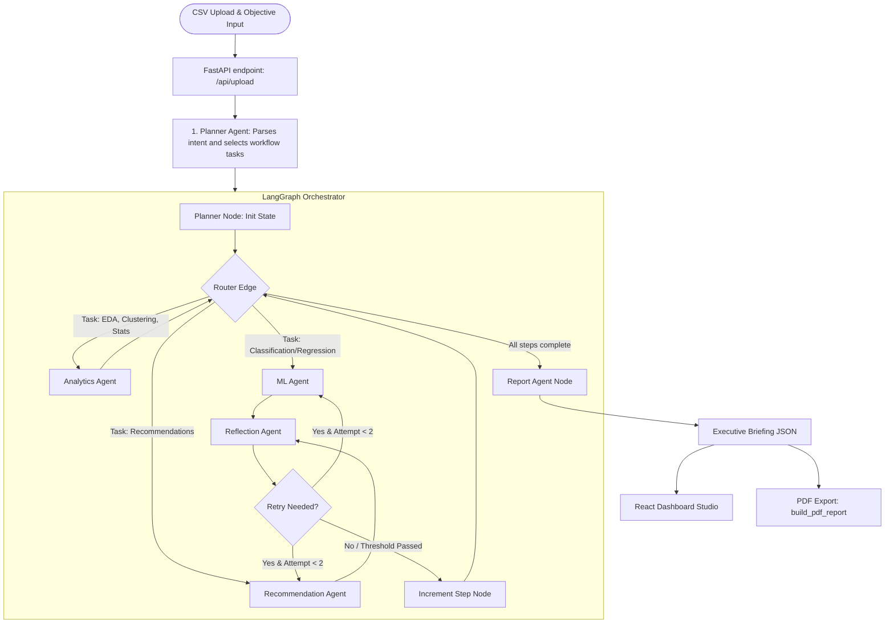

# Agentic AI Analytics Platform

An advanced, domain-agnostic autonomous multi-agent data analytics and intelligence platform. This system utilizes a **LangGraph StateGraph orchestration** workflow to dynamically plan and execute exploratory data analysis (EDA), statistical modeling, unsupervised clustering, Scikit-Learn predictive modeling, self-correcting validation loops, and LLM-synthesized executive briefings. 

Users can upload any CSV dataset, specify a business objective, and watch the platform orchestrate the agents in real-time before generating interactive charts and exportable consulting-grade reports (PDF and Markdown).

---

## 🏗️ Multi-Agent Architecture & Flow

The system is built on a structured state machine managed by **LangGraph**. The workflow transitions data through a sequence of specialized agents:



### The Self-Correction Mechanism (Reflection Agent)
To ensure consulting-grade accuracy, the workflow integrates a **Reflection Agent** that monitors output quality:
* **Model Validation**: If a classification accuracy or regression $R^2$ score falls below a **75% threshold**, the agent triggers a retry loop. It instructs the ML agent to switch algorithms (e.g., from `RandomForest` to a baseline `LogisticRegression` or `LinearRegression`) to improve performance or stability.
* **Insights Validation**: If generated strategic recommendations are too brief (< 150 characters), the agent rejects the output and prompts the Recommendation Agent with targeted instructions to provide deeper, metric-oriented strategic actions.

---

## 📁 Repository Directory Structure

```text
├── Backend/
│   ├── agents/                   # Agent Definitions (Orchestrated by LangGraph)
│   │   ├── analytics_agent.py    # Statistical summaries, correlations, and clustering
│   │   ├── ml_agent.py           # Machine learning model training and feature importances
│   │   ├── planner_agent.py      # Parses intent and constructs the execution plan
│   │   ├── recommendation_agent.py # Formulates strategic recommendations via LLM (Groq)
│   │   ├── reflection_agent.py   # Heuristic self-correction logic (checks model R2/accuracy & insights)
│   │   └── report_agent.py       # Synthesizes final JSON executive briefing
│   ├── executors/
│   │   └── workflow_executor.py  # Compiles and runs the LangGraph StateGraph pipeline
│   ├── goal_engine/
│   │   ├── insight_generator.py  # Baseline insights engine
│   │   ├── intent_parser.py      # Basic intent parser
│   │   └── workflow_router.py    # Standard routing helpers
│   ├── reports/
│   │   └── pdf_generator.py      # Generates premium print-ready PDF via FPDF2
│   ├── services/
│   │   ├── chart_service.py      # Formats data for frontend visualizer
│   │   ├── eda_service.py        # Numerical and categorical summaries
│   │   └── insights_service.py   # Base stats extraction
│   ├── Dockerfile                # Python 3.10-slim container config
│   ├── requirements.txt          # Python dependencies
│   ├── main.py                   # FastAPI application router & REST endpoints
│   └── .env                      # API keys & configuration secrets (Git-ignored)
│
├── Frontend/
│   ├── src/
│   │   ├── assets/               # Static assets
│   │   ├── components/           # React dashboard UI components
│   │   │   ├── AIInsights.jsx    # Displays LLM recommendations and insights
│   │   │   ├── AgentWorkflow.jsx # Renders real-time multi-agent execution status & console logs
│   │   │   ├── ChartsPanel.jsx   # Renders dataset charts (distributions, correlations, clusters)
│   │   │   ├── DashboardLayout.jsx # Coordinates layout tabs, downloads, and correlation matrix
│   │   │   ├── DataSummary.jsx   # Displays statistics cards and dataset metrics
│   │   │   ├── ExecutiveReport.jsx # Consulting report panel with PDF/MD download controls
│   │   │   ├── FileUpload.jsx    # File drag-and-drop component with objective prompt field
│   │   │   └── KPICards.jsx      # High-level metrics summaries
│   │   ├── App.css               # Component specific styling rules
│   │   ├── App.jsx               # React main app framework
│   │   ├── index.css             # Root TailwindCSS styling entrypoint
│   │   └── main.jsx              # React app mounter
│   ├── Dockerfile                # Node 18-alpine container config
│   ├── tailwind.config.js        # UI utility classes configuration
│   ├── vite.config.js            # Vite build configuration
│   └── package.json              # NPM dependencies
│
└── docker-compose.yml            # Multi-container orchestrator configuration
```

---

## 🤖 Detailed Agent Registry

### 1. Planner Agent ([planner_agent.py](file:///Backend/agents/planner_agent.py))
* **Objective**: Analyzes the business objective submitted by the user and parses the intent.
* **Process**: Connects to the Groq API (running `llama-3.1-8b-instant`) to output a structured JSON plan choosing from a registry of available tasks: `dataset_summary`, `correlation_analysis`, `segment_analysis`, `outlier_detection`, `clustering`, `forecasting`, `classification_model`, `regression_model`, and `recommendation_generation`.

### 2. Analytics Agent ([analytics_agent.py](file:///Backend/agents/analytics_agent.py))
* **Objective**: Extracts foundational metrics from numerical and categorical features.
* **Metrics**: Calculates mean, median, standard deviation, row counts, and duplicates. Detects outliers using Interquartile Range (IQR) bounds. Runs K-Means Clustering on numerical subsets using `scikit-learn` to group matching records dynamically.

### 3. ML Agent ([ml_agent.py](file:///Backend/agents/ml_agent.py))
* **Objective**: Builds predictive models to solve classification or regression objectives.
* **Process**: Auto-selects continuous or discrete target columns, handles basic label encoding, splits training and validation data, and fits models (`RandomForest` or simple linear/logistic regression). Extracts feature coefficients or model importances to determine the top drivers.

### 4. Reflection Agent ([reflection_agent.py](file:///Backend/agents/reflection_agent.py))
* **Objective**: Inspects the quality parameters of models and recommendation structures.
* **Actions**: Checks if validation metrics ($R^2$ or accuracy) are $\ge 75\%$. If not, triggers an internal graph transition to train alternative models. Ensures recommendations are descriptive and meet length standards.

### 5. Recommendation Agent ([recommendation_agent.py](file:///Backend/agents/recommendation_agent.py))
* **Objective**: Infuses LLM intelligence into the business objective using statistical evidence.
* **Constraints**: Avoids generic fluff. Leads with crisp, quantitative conclusions paired with direct strategic directives under 30 words per suggestion.

### 6. Report Agent ([report_agent.py](file:///Backend/agents/report_agent.py))
* **Objective**: Aggregates multi-agent logs and analytics into a cohesive consulting report schema.
* **Schema**: Generates a unified JSON containing an `executive_summary`, key `insights` lists, structured evidence-linked `recommendations`, and a final `risk_summary`.

---

## ⚙️ Tech Stack & Key Libraries

### Backend
* **FastAPI**: Main web application wrapper and endpoint engine.
* **LangGraph**: Multi-agent graph orchestrator using StateGraph nodes.
* **Groq SDK**: Executes high-speed Llama-3.1 API completions.
* **Pandas & NumPy**: Quantitative data manipulation, schema inference, and calculations.
* **Scikit-Learn**: Machine learning engine (K-Means, RandomForest, Logistic/Linear Regression).
* **FPDF2**: Formats output JSON data into professional print layouts.

### Frontend
* **Vite & React (v19)**: Build tools and UI framework.
* **TailwindCSS**: CSS framework for visual styles and glassmorphism layouts.
* **Recharts**: Renders visual interactive analytics charts.
* **Lucide React**: Vector design iconography.
* **Axios**: Communicates with the FastAPI backend.

---

## 🚀 Installation & Setup

### Option 1: Run with Docker Compose (Recommended)
This launches both the Backend API (port `8000`) and the React Frontend UI (port `5173`) in containerized environments.

1. Make sure you have **Docker Desktop** installed.
2. In the project root, create a file named `Backend/.env` (see the section [Environment Variables](#-environment-variables) below).
3. Run the following command:
   ```bash
   docker-compose up --build
   ```
4. Access the frontend app in your browser at: `http://localhost:5173`.

---

### Option 2: Local Manual Setup

If you prefer to run the applications directly on your host machine:

#### 1. Backend Setup
1. Open a terminal and navigate to the backend directory:
   ```bash
   cd Backend
   ```
2. Create and activate a Python virtual environment:
   ```bash
   python -m venv venv
   # On Windows (Command Prompt)
   venv\Scripts\activate
   # On Windows (PowerShell)
   .\venv\Scripts\Activate.ps1
   # On macOS/Linux
   source venv/bin/activate
   ```
3. Install required packages:
   ```bash
   pip install -r requirements.txt
   ```
4. Create a `.env` file in the `Backend` directory containing your keys.
5. Run the FastAPI development server:
   ```bash
   uvicorn main:app --reload --host 0.0.0.0 --port 8000
   ```
   *The backend will now be running at `http://localhost:8000`. You can inspect the Swagger API docs at `http://localhost:8000/docs`.*

#### 2. Frontend Setup
1. Open a new terminal and navigate to the frontend directory:
   ```bash
   cd Frontend
   ```
2. Install npm packages:
   ```bash
   npm install
   ```
3. Run the Vite development server:
   ```bash
   npm run dev
   ```
   *The frontend dashboard will launch at `http://localhost:5173`.*

---

## 🔑 Environment Variables

The backend requires a `.env` file located inside the `Backend/` directory:

```env
# Backend/.env
GROQ_API_KEY=your_groq_api_key_here
```

*Note: If `GROQ_API_KEY` is not provided, the application will fallback to rule-based analytics models and static report templates.*

---

## 🔗 Key API Endpoints

### `POST /api/upload`
Uploads a CSV file and processes it through the Multi-Agent system.
* **Parameters**: 
  * `file`: (CSV file upload)
  * `objective`: (String) Optional business objective (e.g. "Identify churn factors and predict high-value user risk").
* **Response**: A JSON structure containing execution plans, statistical logs, charts data, ML models metadata, and the compiled executive report.

### `POST /api/download-pdf`
Generates and downloads a print-ready PDF version of the consulting briefing.
* **Body (JSON)**:
  ```json
  {
    "report": { ... },
    "objective": "Objective name"
  }
  ```
* **Response**: Binary stream of the PDF file (`application/pdf`).
